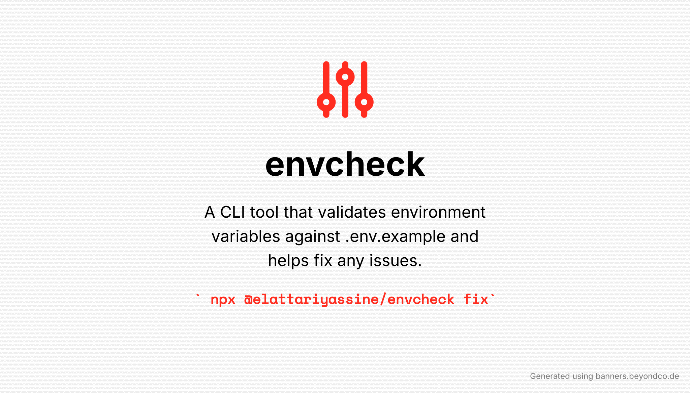

# envcheck



[![npm package][npm-img]][npm-url]
[![Build Status][build-img]][build-url]
[![Downloads][downloads-img]][downloads-url]
[![Issues][issues-img]][issues-url]
[![Semantic Release][semantic-release-img]][semantic-release-url]

> A powerful Node.js CLI tool for validating, managing, and fixing environment variables in your projects. Automatically detects missing or invalid variables, provides interactive fixes, and ensures your .env files match your .env.example templates. Built with TypeScript for type safety and reliability.

## Features

- 🔍 Validate environment variables against `.env.example`
- 🛠️ Interactive mode to fix missing or invalid variables
- 📝 Support for different variable types (string, number, boolean)
- 🎨 Colorized output for better readability
- 🔒 Secure handling of sensitive information
- 🔄 Custom file paths for `.env` and `.env.example`
- 📊 Detailed validation reports
- 📋 Preserves file formatting and comments when updating files

## Installation

You can use EnvCheck in two ways:

### 1. Using npx (Recommended for one-time use)

```bash
npx @elattariyassine/envcheck init
npx @elattariyassine/envcheck validate
npx @elattariyassine/envcheck fix
```

### 2. Global Installation

```bash
npm install -g @elattariyassine/envcheck
```

After global installation, you can use the commands directly:

```bash
envcheck init
envcheck validate
envcheck fix
```

## Local Development Setup

To set up the project locally for development:

1. Clone the repository:

```bash
git clone https://github.com/elattariyassine/envcheck.git
cd envcheck
```

2. Install dependencies:

```bash
npm install
```

3. Build the project:

```bash
npm run build
```

4. Link the package locally for testing:

```bash
npm link
```

Now you can use `envcheck` commands globally while developing.

### Available Scripts

- `npm run build` - Compiles TypeScript code to JavaScript
- `npm test` - Runs Jest tests
- `npm run lint` - Runs ESLint to check code quality
- `npm run format` - Formats code using Prettier

### Development Workflow

1. Make your changes in the `src` directory
2. Run tests to ensure everything works: `npm test`
3. Build the project: `npm run build`
4. Test your changes using the CLI commands

To unlink the package when you're done:

```bash
npm unlink
```

## Usage

### Initialize Environment Files

```bash
npx @elattariyassine/envcheck init
```

This command will:

1. Create a new `.env.example` file with common environment variables
2. Include examples for different types of variables (string, number, boolean)
3. Add helpful comments for each section
4. Maintain proper formatting and structure

### Validate Environment Variables

```bash
npx @elattariyassine/envcheck validate
```

This command will:

1. Read your `.env` and `.env.example` files
2. Validate all required variables
3. Check variable types and formats
4. Display any errors or warnings
5. Preserve all existing comments and formatting

### Fix Environment Variables

```bash
npx @elattariyassine/envcheck fix
```

This command will:

1. Check for missing or invalid variables
2. Prompt you to enter values for missing variables (in interactive mode)
3. Update your `.env` file with the new values
4. Maintain all existing comments, section headers, and formatting
5. Keep the file structure clean and organized

### Command Options

```bash
# Show version
npx @elattariyassine/envcheck -V
npx @elattariyassine/envcheck --version

# Fix command options
npx @elattariyassine/envcheck fix --file custom.env           # Use custom .env file
npx @elattariyassine/envcheck fix --example custom.example    # Use custom .env.example file
npx @elattariyassine/envcheck fix --no-interactive           # Disable interactive mode

# Show help for any command
npx @elattariyassine/envcheck --help
npx @elattariyassine/envcheck validate --help
npx @elattariyassine/envcheck fix --help
```

## Example Files

### .env.example

```env
# Database Configuration
DB_HOST=localhost
DB_PORT=5432
DB_NAME=myapp
DB_USER=postgres
DB_PASSWORD=your_password

# API Configuration
API_URL=https://api.example.com
API_KEY=your_api_key
API_TIMEOUT=5000

# Feature Flags
DEBUG_MODE=false
ENABLE_CACHE=true

# Email Configuration
SMTP_HOST=smtp.example.com
SMTP_PORT=587
SMTP_USER=your_email
SMTP_PASS=your_password

# Redis Configuration
REDIS_HOST=localhost
REDIS_PORT=6379
REDIS_PASSWORD=

# Logging Configuration
LOG_LEVEL=info
LOG_FILE=app.log

# Security Configuration
JWT_SECRET=your_jwt_secret
SESSION_TIMEOUT=3600
```

### .env (with some invalid values)

```env
# Database Configuration
DB_HOST=localhost
DB_PORT=not-a-number
DB_NAME=myapp
DB_USER=postgres
DB_PASSWORD=secret123

# API Configuration
API_URL=not-a-url
API_KEY=abc123
API_TIMEOUT=5000

# Feature Flags
DEBUG_MODE=not-a-boolean
ENABLE_CACHE=true

# Email Configuration
SMTP_HOST=smtp.example.com
SMTP_PORT=587
SMTP_USER=your_email
SMTP_PASS=your_password

# Redis Configuration
REDIS_HOST=localhost
REDIS_PORT=6379
REDIS_PASSWORD=

# Logging Configuration
LOG_LEVEL=info
LOG_FILE=app.log

# Security Configuration
JWT_SECRET=your_jwt_secret
SESSION_TIMEOUT=3600
```

## Contributing

Contributions are welcome! Please feel free to submit a Pull Request.

## TODO

- [x] Create basic CLI structure
- [x] Implement environment variable validation
- [x] Add interactive mode for fixing variables
- [x] Add support for different variable types
- [x] Implement file formatting preservation
- [x] Add GitHub Actions workflows
- [x] Set up semantic-release
- [x] Add comprehensive tests
- [x] Add version command
- [x] Update license to ISC
- [x] Update package name to be scoped
- [ ] Add usage examples in README

## License

ISC

[build-img]: https://github.com/elattariyassine/envcheck/actions/workflows/release.yml/badge.svg
[build-url]: https://github.com/elattariyassine/envcheck/actions/workflows/release.yml
[downloads-img]: https://img.shields.io/npm/dt/@elattariyassine/envcheck
[downloads-url]: https://www.npmtrends.com/@elattariyassine/envcheck
[npm-img]: https://img.shields.io/npm/v/@elattariyassine/envcheck
[npm-url]: https://www.npmjs.com/package/@elattariyassine/envcheck
[issues-img]: https://img.shields.io/github/issues/elattariyassine/envcheck
[issues-url]: https://github.com/elattariyassine/envcheck/issues
[semantic-release-img]: https://img.shields.io/badge/%20%20%F0%9F%93%A6%F0%9F%9A%80-semantic--release-e10079.svg
[semantic-release-url]: https://github.com/semantic-release/semantic-release
